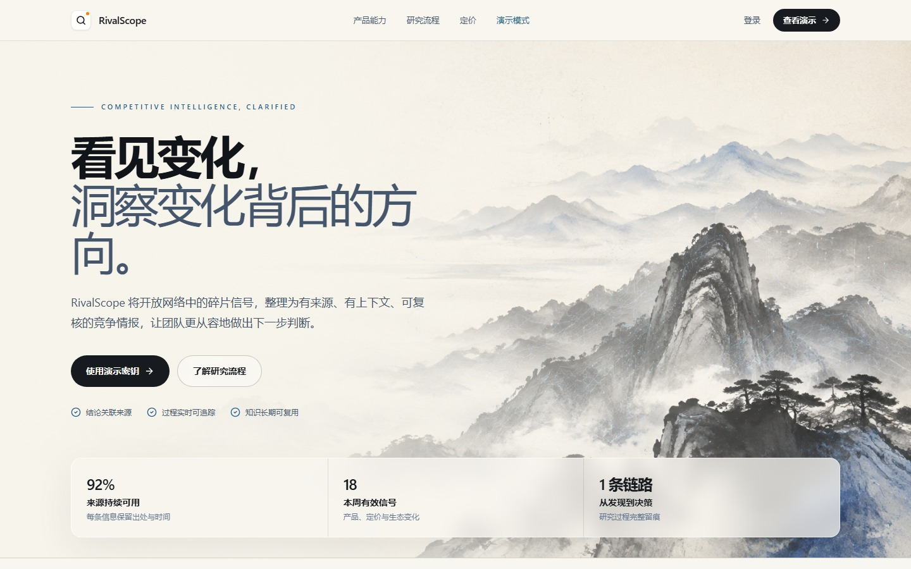
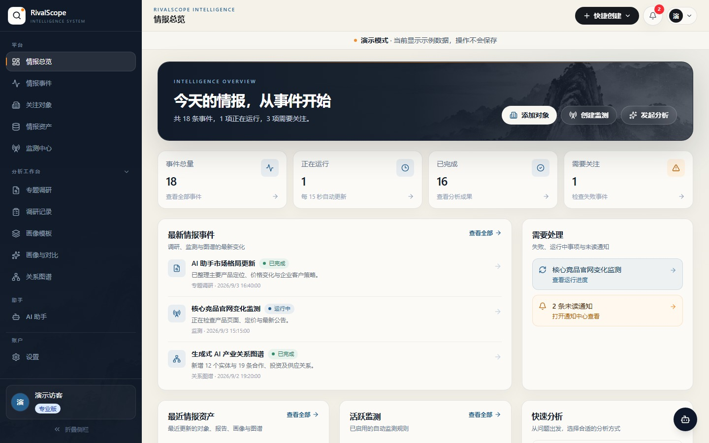

# RivalScope

[](https://github.com/JimmyZhang06/rivalscope/actions/workflows/ci.yml)


[](LICENSE)

面向产品、市场、战略与研究团队的可追溯竞争情报平台。

RivalScope 将联网检索、网页采集、证据治理、企业画像、横向对比、关系图谱和持续监测整合为统一工作流，让团队不仅得到结论，也能随时回到结论背后的来源、时间和上下文。

**在线体验：** [jimmyzhang.xyz](https://jimmyzhang.xyz)

**演示密钥：** `RIVALSCOPE-DEMO-2026`

> 线上演示使用前端示例数据，操作不会保存；接入真实检索、模型与持久化能力需运行完整后端。



## 为什么使用 RivalScope

- **证据可追溯**：报告结论与来源材料保持引用关系，记录链接、时间、相关度和访问状态。
- **研究可复用**：报告、企业画像、对比结果、关系图谱与监测事件沉淀为长期资产。
- **过程可观察**：调研任务通过 SSE 返回阶段进度，从检索规划到报告生成全程可见。
- **协作可治理**：支持个人与组织工作区、成员角色、套餐配额、审计记录和会话安全。
- **能力可扩展**：兼容 OpenAI 风格模型接口，并可结合 Tavily、SMTP 等外部服务。

## 产品界面



工作台围绕情报事件组织日常工作：查看最新变化、跟踪运行任务、管理竞品资产，并从同一入口发起专题调研、企业画像、横向对比与关系图谱分析。

## 核心能力

| 模块 | 能力 |
| --- | --- |
| 专题调研 | 根据研究目标规划检索、采集公开信息并生成结构化报告 |
| 证据管理 | 保存来源、抓取状态、引用关系与时间信息，支持复核 |
| 关注对象 | 管理企业、产品和站点资料，形成长期竞品档案 |
| 企业画像 | 通过可配置模板生成标准化画像，支持冻结与版本记录 |
| 画像对比 | 按统一维度比较多个对象，沉淀差异与评分 |
| 关系图谱 | 提取企业、产品、合作、投资及上下游关系 |
| 持续监测 | 定时捕获目标变化，归档为情报事件和内容资产 |
| AI 助手 | 基于已沉淀的研究数据进行问答、归纳与内容辅助 |

## 研究工作流

```text
研究目标
   │
   ▼
检索规划 ──► 联网搜索 ──► 页面采集 ──► 证据清洗与去重
                                           │
                                           ▼
                         分析报告 / 企业画像 / 关系图谱
                                           │
                                           ▼
                              持续追踪与团队知识资产
```

## 技术架构

```text
┌──────────────────────────────────────────────────────────┐
│ React 18 · TypeScript · Vite · Zustand · Recharts       │
└───────────────────────────┬──────────────────────────────┘
                            │ REST / SSE
┌───────────────────────────▼──────────────────────────────┐
│ FastAPI · Pydantic · SQLAlchemy · JWT                   │
├──────────────────────────────────────────────────────────┤
│ Research · Crawling · Profiles · Graph · Monitoring     │
└───────────────┬───────────────────────┬──────────────────┘
                │                       │
        OpenAI-compatible LLM       Tavily Search
                │                       │
                └───────────┬───────────┘
                            ▼
                  SQLite by default
```

- **前端**：React、TypeScript、Vite、Tailwind CSS、Zustand、Recharts、React Flow
- **后端**：Python、FastAPI、SQLAlchemy、Pydantic、SSE、JWT、bcrypt
- **数据与集成**：SQLite、OpenAI 兼容模型接口、Tavily、SMTP（可选）
- **质量保障**：pytest、TypeScript 编译、Vite 生产构建、GitHub Actions、Bandit、依赖审计

## 快速开始

### 环境要求

- Python 3.12+
- Node.js 20.19+ 或 22.12+
- npm 10+

真实调研还需要 OpenAI 兼容模型凭据；联网检索需要 Tavily API Key。

### Windows 一键启动

```powershell
git clone https://github.com/JimmyZhang06/rivalscope.git
cd rivalscope
Copy-Item backend/.env.example backend/.env
.\start.ps1
```

也可以双击 `start.bat`。首次启动会创建 Python 虚拟环境并安装前后端依赖。

启动后访问：

- 前端：<http://localhost:5173>
- API：<http://127.0.0.1:8000>
- OpenAPI：<http://127.0.0.1:8000/docs>
- 健康检查：<http://127.0.0.1:8000/api/health>

### 手动启动

后端：

```powershell
cd backend
python -m venv .venv
.\.venv\Scripts\python.exe -m pip install -r requirements.txt
.\.venv\Scripts\python.exe -m uvicorn app.main:app --reload --port 8000
```

前端：

```powershell
cd frontend
npm install
npm run dev
```

macOS 或 Linux 请将 Python 路径替换为 `.venv/bin/python`。

## 环境配置

复制 `backend/.env.example` 后，至少配置：

```dotenv
APP_ENV=development

LLM_BASE_URL=https://api.deepseek.com/v1
LLM_API_KEY=replace-with-your-key
LLM_MODEL=deepseek-chat

TAVILY_API_KEY=replace-with-your-key
JWT_SECRET=replace-with-a-long-random-secret
```

需要密码找回或敏感字段加密时，另行生成 Fernet 主密钥并设置 `MASTER_KEY`。完整变量说明见 [`backend/.env.example`](backend/.env.example)。

不要提交真实 `.env`、API Key、邮件密码、数据库或用户数据。

## 测试与构建

后端测试：

```powershell
cd backend
.\.venv\Scripts\python.exe -m pip install -r requirements-dev.txt
.\.venv\Scripts\python.exe -m pytest -q
```

前端构建：

```powershell
cd frontend
npm ci
npm run build
```

CI 会执行 Python 编译、pytest、Bandit、Python/npm 依赖审计、TypeScript 检查和 Vite 生产构建。

## 项目结构

```text
.
├── assets/                  # README 界面截图
├── backend/
│   ├── app/
│   │   ├── api/             # REST、SSE 与权限入口
│   │   ├── core/            # 配置、安全、配额与基础设施
│   │   ├── db/              # 数据模型、会话与审计触发器
│   │   ├── schemas/         # 请求与响应模型
│   │   └── services/        # 调研、采集、画像、图谱与监测服务
│   ├── scripts/             # 数据迁移与样例数据工具
│   └── tests/               # 后端回归测试
├── frontend/
│   ├── .openai/             # Sites 托管配置
│   └── src/
│       ├── api/              # API 客户端、共享类型和演示数据
│       ├── auth/             # 身份状态与路由保护
│       ├── components/       # 通用界面组件
│       ├── pages/            # 页面与业务流程
│       └── stores/           # Zustand 状态管理
├── .github/workflows/        # 持续集成
├── start.ps1                 # Windows 自动启动脚本
└── start.bat                 # Windows 双击入口
```

## 部署说明

GitHub Pages 前端 + 阿里云后端的部署配置与切换步骤见 [`deploy/README.md`](deploy/README.md)。目标前端域名为 `rivalscope.jimmyzhang.xyz`；服务器、DNS 和 GitHub Pages 尚需实际配置及验证，当前在线体验地址不代表已经切换。

线上演示站采用静态前端部署，`frontend/.openai/hosting.json` 保存 Sites 项目标识和构建目录。完整生产部署还应：

- 使用 `APP_ENV=production`，通过密钥管理服务注入 `JWT_SECRET`、`MASTER_KEY` 和第三方凭据；
- 将 `FRONTEND_ORIGINS` 限制为可信 HTTPS 域名；
- 使用独立数据库、迁移审查、定期备份和最小权限账号；
- 仅在 SMTP 与邮件域名验证完成后启用真实邮件发送；
- 保持 `ENABLE_SIMULATED_BILLING=false`，演示账单不得用于真实交易。

## 安全与负责任使用

- 只采集依法允许访问的公开信息，并遵守目标站点条款、robots 策略和适用法律。
- AI 生成内容可能存在遗漏或错误，重要结论应结合引用来源人工复核。
- 不要在提交、Issue、日志或截图中披露密钥、访问令牌或用户数据。
- 安全问题请通过仓库所有者的私密联系方式报告，不要公开披露可利用细节。

## 许可证

Copyright © 2026 JimmyZhang06. All rights reserved.

RivalScope 依据 [PolyForm Noncommercial License 1.0.0](LICENSE) 提供源码，仅授权许可证定义范围内的非商业用途。商业部署、收费服务或将本项目集成到商业解决方案中，需要事先取得单独的书面授权。

如需商业许可，请联系 [GitHub 仓库所有者](https://github.com/JimmyZhang06)。
