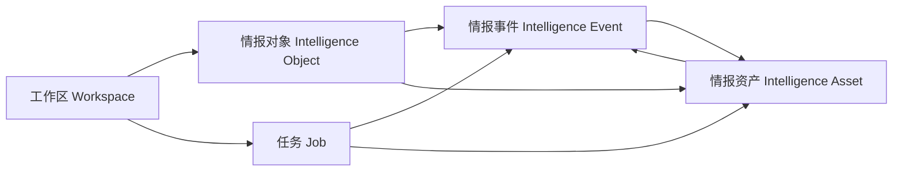

# 聚合式竞争情报平台：产品与信息架构改造计划

> 适用基线：`agent-v8` / `a098c08`
> 文档性质：产品边界、领域模型、信息架构与分阶段验收基线
> 核心原则：竞品调研保留为深度分析能力，但不再作为产品本体；平台以“工作区中的情报对象、事件和资产”为中心持续运行。

## 1. 结论与产品定位

### 1.1 推荐定位

将当前“竞品调研 Agent”升级为：

> **聚合式竞争情报平台（Competitive Intelligence Hub）**：把外部来源、持续监测、专题调研、结构化画像、关系图谱和团队协作聚合到统一工作区，帮助团队发现变化、验证证据并形成可执行判断。

这里的“聚合”不是做一个无边界的通用企业门户，而是聚合以下五类内容：

1. **关注对象**：企业、产品、品牌、人物、机构、技术与赛道。
2. **外部信号**：官网变化、新闻、发布、价格、融资、合作、人员、技术和监管动态。
3. **内部情报资产**：报告、画像、对比、图谱、来源、网页快照和人工笔记。
4. **执行能力**：一次性调研、定时监测、官网采集、画像生成、对比与图谱构建。
5. **协作动作**：预警分派、状态处理、评论、收藏、标签、分享和通知。

### 1.2 用户首先购买的价值

平台首页应首先回答四个问题：

- 今天发生了什么？
- 哪些变化与我关注的对象和主题有关？
- 哪些信号值得验证或处理？
- 系统正在执行什么，已经沉淀了哪些可复用资产？

竞品调研负责回答复杂、阶段性的研究问题，是“分析工作台”中的一种任务模板。它不应继续决定首页、主导航、数据命名和全部计费口径。

### 1.3 核心用户与典型工作

| 用户 | 核心工作 | 平台提供的结果 |
|---|---|---|
| 产品/战略团队 | 跟踪产品、路线、定价和市场进入 | 对象动态流、专题调研、横向对比 |
| 市场/销售团队 | 识别竞争动作与话术变化 | 事件预警、证据卡片、可分享摘要 |
| 投研/咨询团队 | 建立长期覆盖与证据链 | 画像版本、来源快照、关系图谱、报告 |
| 管理者 | 关注高优先级风险和团队产出 | 情报摘要、处置状态、覆盖度与成本指标 |
| 平台管理员 | 管理组织、权限、模型和审计 | 工作区管理、访问控制、用量与审计 |

### 1.4 产品北极星与边界

北极星不是“生成报告数量”，而是：

> **每周被团队确认并消费的高价值情报事件数。**

建议辅助指标：重点对象覆盖率、有效信号率、从发现到确认的中位时间、证据可追溯率、周活跃工作区、资产复用率。

平台当前仍应聚焦竞争和市场情报，不进入 CRM、项目管理、通用 BI、企业知识库或自动代替人做外部业务决策。

## 2. 当前基线与结构性不足

### 2.1 已有能力可直接复用

当前仓库不是从零开始，已有一条相对完整的情报生产链：

- `Competitor`、官网爬取与 `CompetitorPage`：已有关注企业及官网材料。
- `ResearchTask`、`TaskStep`、`Source`、`SourceArchive`：已有调研、执行轨迹、来源与快照证据。
- `CompetitorProfile`、`ProfileTemplate`、`ProfileGenerationTask`：已有结构化画像、模板和后台生成任务。
- `Tracker`、`Notification`：已有定时追踪及站内/邮件/Webhook 通知能力。
- `GraphProject`、`GraphEntity`、`GraphRelation`：已有企业、产品、人物和机构关系抽取能力。
- `AssistantSession`、`AssistantMessage`：已有报告问答入口。
- `Organization`、`UserPermission`、`AuditLog`、`ExecutionSnapshot`：已有组织、轻量权限、审计和执行留痕。

### 2.2 当前产品组织的问题

1. **入口以功能为中心。** 侧栏按“调研/追踪/画像/图谱”平铺，同一个竞品的信息散落在多个页面。
2. **首页以任务统计为中心。** 当前仪表盘展示任务、画像、追踪数量，没有统一的事件流、风险优先级和待处理事项。
3. **`Competitor` 概念过窄。** 图谱已经能抽取 company/product/org/person，但主体库只认识竞品公司，无法统一产品、技术、人物和赛道。
4. **没有一等公民的“事件”。** `change_summary` 和 `Notification` 是文本结果，不能按事件类型、对象、严重度、确认状态、时间和证据查询。
5. **资产没有统一目录。** 报告、画像、来源、快照、网页和图谱分散存储，缺少统一检索、标签、收藏、生命周期和引用关系。
6. **多种后台任务没有统一任务模型。** 调研、爬取、画像和图谱分别维护状态，无法形成统一任务中心、重试策略和可靠运行统计。
7. **组织不等于工作区。** `Organization` 同时承担付费、成员和数据隔离，但缺少面向业务主题的工作区、个人默认空间和跨团队边界。
8. **AI 助手只检索已完成调研报告。** 它尚不能统一引用画像、事件、来源、图谱和对象资料，无法真正成为平台级助手。
9. **关联主要靠名称或松散 ID。** 例如 `ResearchTask.competitors`、`Tracker.competitors` 是文本，后续去重、重命名、聚合和统计不可靠。
10. **通知不等于处置。** 当前通知只有已读状态，没有负责人、确认、忽略、解决、备注、升级等工作流。

## 3. 目标领域模型

### 3.1 五个核心对象

#### A. 工作区（Workspace）

工作区是所有业务数据的首要隔离、权限和协作边界。

最小字段：`id`、`name`、`type(personal/team)`、`owner_id`、`organization_id`、`status`、`settings`、`created_at`。

规则：

- 每个用户创建一个个人默认工作区，加入企业后可访问一个或多个团队工作区。
- 所有对象、事件、资产和任务必须有 `workspace_id`，禁止以空字符串表达“系统/个人”语义。
- `Organization` 保留为成员与计费主体；`Workspace` 是内容与协作主体，两者不再混用。
- 第一阶段可保持“一企一默认工作区”，但 API 和数据模型应为多工作区预留清晰边界。

#### B. 情报对象（Intelligence Object）

被持续关注、关联和分析的统一主体。

建议类型：`company`、`product`、`brand`、`person`、`organization`、`technology`、`market`。第一阶段正式支持 company/product，其他类型先保留枚举和基础展示。

最小字段：`id`、`workspace_id`、`type`、`canonical_name`、`aliases`、`website`、`description`、`tags`、`status`、`external_refs`、`created_by`、`created_at`、`updated_at`。

配套关系：`ObjectRelation(source_object_id, target_object_id, relation_type, confidence, valid_from, valid_to, evidence_asset_id)`。

映射原则：

- 现有 `Competitor` 迁移为 `company` 类型对象；保留兼容 API，前端改称“情报对象”。
- `GraphEntity` 经过实体消歧后链接到统一对象，而不是每个图谱项目重新制造孤立实体。
- 调研、追踪和画像不再保存逗号分隔名称，改用对象关联表。

#### C. 情报事件（Intelligence Event）

事件是控制台首页和监测中心的核心消费单元，表示“某个对象在某时发生了值得关注的变化”。

建议类型：`product_launch`、`pricing_change`、`feature_change`、`funding_mna`、`partnership`、`customer_win`、`executive_change`、`market_entry`、`technology_change`、`regulatory`、`sentiment`、`other`。

最小字段：

- 身份：`id`、`workspace_id`、`event_type`、`title`、`summary`。
- 关联：主对象与相关对象、多份证据资产、产生它的任务。
- 时间：`occurred_at`、`detected_at`、`valid_from`。
- 判断：`severity(info/low/medium/high/critical)`、`confidence`、`novelty_score`。
- 工作流：`status(new/triaged/confirmed/dismissed/resolved)`、`assignee_id`、`handled_at`、`resolution_note`。
- 去重：`fingerprint`、`supersedes_event_id`。

事件必须是结构化记录，`Notification` 仅作为事件被投递给某个用户后的副产品。`ResearchTask.change_summary` 可保留为报告展示，但不能继续承担事件库职责。

#### D. 情报资产（Intelligence Asset）

资产是可复用、可检索、可引用的知识单元，而不只是一个文件。

建议类型：`source`、`web_snapshot`、`report`、`profile`、`comparison`、`graph`、`note`、`attachment`、`brief`。

统一目录字段：`id`、`workspace_id`、`asset_type`、`title`、`summary`、`status`、`object_ids`、`event_ids`、`tags`、`created_by`、`source_task_id`、`visibility`、`version`、`created_at`、`updated_at`。

实施时不必立即把所有内容搬进一张大表。推荐使用轻量 `AssetIndex` 作为统一目录和检索入口，正文仍留在 `ResearchTask`、`SourceArchive`、`CompetitorProfile`、`GraphProject` 等专业表，通过 `resource_type + resource_id` 引用。这样避免大爆炸式迁移。

#### E. 任务（Job）

统一表示一次异步执行，类型包括：`research`、`monitor_run`、`crawl`、`profile_generate`、`compare`、`graph_build`、`event_extract`、`digest_generate`。

最小字段：`id`、`workspace_id`、`job_type`、`status(queued/running/succeeded/failed/cancelled)`、`progress`、`current_stage`、`input_ref`、`result_refs`、`parent_job_id`、`trigger(manual/schedule/api)`、`attempt`、`error_code`、`error_detail`、`created_by`、`started_at`、`finished_at`。

现有专业任务表可以继续保存业务参数，统一 Job 先作为编排和观测外壳。所有长任务应支持幂等键、超时、重试和取消语义。

### 3.2 支撑对象

- **Collection/Watchlist**：用户按主题组织对象，例如“国内低代码”“机器人核心供应商”。
- **MonitorRule**：以对象/集合、信号类型、关键词、频率和通知策略描述监测，而不再以一串产品名表示。
- **Tag**：工作区级统一标签，供对象、事件和资产共用。
- **Comment/Activity**：记录事件处置、资产评论和对象变更，形成协作时间线。
- **SavedView**：保存筛选和排序条件；第一阶段可只做前端 URL 查询参数，暂不建复杂视图引擎。

### 3.3 数据归属与不变量

1. 任何业务查询先按 `workspace_id` 过滤，再做资源级权限判断。
2. 所有关联使用稳定 ID；名称只用于展示和搜索。
3. 任一自动生成的事件或判断必须能回溯到至少一份证据资产；无证据内容只能标为待验证草稿。
4. 来源、事件和画像不做静默覆盖；更新产生版本或变更记录。
5. AI 输出不能直接把高风险事件标记为“已确认”，确认必须由规则或用户完成。
6. 删除对象前必须处理关联事件和资产，默认归档而非级联物理删除。

## 4. 目标信息架构

### 4.1 一级导航

| 一级入口 | 用户问题 | 主要页面 |
|---|---|---|
| 情报总览 | 今天最值得关注什么？ | 工作区摘要、重点事件、待办、覆盖状态 |
| 监测中心 | 系统发现了哪些变化？ | 事件流、监测规则、预警队列、摘要订阅 |
| 情报对象 | 我们在关注谁/什么？ | 对象库、集合、对象详情、关系 |
| 分析工作台 | 我需要主动回答什么问题？ | 专题调研、画像、横向对比、图谱分析 |
| 情报资产 | 已经掌握了什么证据和成果？ | 报告、来源、快照、画像、图谱、收藏 |
| 任务中心 | 系统正在做什么？ | 全类型任务、运行历史、失败重试 |
| AI 助手 | 基于整个工作区能得出什么？ | 工作区问答、引用、会话 |
| 系统管理 | 谁可以访问、花费多少？ | 成员、角色、权限、套餐、服务配置、审计 |

侧栏顶部应提供工作区切换器；个人资料、套餐和退出登录移入用户菜单。管理员入口只对授权角色显示。

### 4.2 首页（情报总览）

首页不再以“欢迎回来 + 新建调研”为主叙事，建议按以下顺序：

1. **时间和工作区范围**：今日/本周、对象集合、事件类型筛选。
2. **关键指标条**：新事件、高优先级、待确认、监测覆盖、失败任务。
3. **核心事件流**：按严重度、新颖度、置信度排序；支持确认、忽略、分派和查看证据。
4. **重点关注**：重点对象最近变化、信息新鲜度和覆盖缺口。
5. **待处理事项**：未确认事件、失败任务、需要人工补证的结论。
6. **运行状态**：未来计划任务、当前执行、数据源健康度。
7. **最近资产**：报告、画像、对比和图谱；展示对象、作者、更新时间和引用数。
8. **快捷动作**：添加对象、创建监测规则、发起专题调研、导入材料。

空状态必须引导完成“建立工作区 → 添加 3 个对象 → 开启监测 → 查看首批事件”，而不是只引导生成报告。

### 4.3 对象详情页

对象详情页成为聚合核心，路由建议为 `/app/objects/:id`：

- 概览：简介、别名、网站、标签、关注状态、数据新鲜度。
- 动态：结构化事件时间线。
- 画像：当前版本、历史版本、字段证据和置信度。
- 资产：与对象关联的报告、来源、快照、图谱和笔记。
- 关系：上下游、竞合、投资和人物关系。
- 监测：已启用规则、最近运行、覆盖范围。
- 活动：团队评论、确认和修改记录。

### 4.4 事件详情页

事件详情页应同时展示：发生了什么、何时发生、关联对象、严重度/置信度、证据原文与快照、相似历史事件、产生任务、处理负责人和状态历史。用户可从事件发起“深度调研”，并将结果回链到事件。

## 5. 现有功能迁移映射

| 现有功能/路由 | 目标归属 | 改造策略 |
|---|---|---|
| `/app` 仪表盘 | 情报总览 | 保留路由，替换为事件优先首页；任务统计降为运行状态组件 |
| `/app/new` 新建调研 | 分析工作台 / 专题调研 | 保留能力；输入改为对象/集合 + 研究问题，支持从事件发起 |
| `/app/tasks*` 调研记录 | 任务中心 + 情报资产 | 执行状态进任务中心，完成报告进入资产库；旧路由兼容跳转 |
| `/app/trackers*` 定时追踪 | 监测中心 / 监测规则 | `Tracker` 演进为按对象/集合配置的 MonitorRule；运行结果生成事件 |
| `/app/competitors` | 情报对象 | 现有竞品导入对象库，新增对象详情；“竞品”作为关系/业务标签而非实体类型 |
| 官网爬取页面 | 对象详情 / 资产 | 爬取操作进入监测或对象动作；网页和快照进入资产目录 |
| `/app/profiles/templates` | 分析工作台设置 | 模板作为画像分析配置；普通用户弱化入口，管理员/高级用户可管理 |
| `/app/profiles`、详情、任务 | 对象详情 / 画像 + 任务中心 | 画像归属于对象；生成过程归统一 Job；列表可作为资产筛选视图保留 |
| `/app/profiles/compare` | 分析工作台 / 横向对比 | 选择对象及画像版本，输出可保存的 comparison 资产 |
| `/app/graph*` | 分析工作台 / 关系分析 | 图实体链接统一对象；完成图谱成为资产，对象详情显示局部关系 |
| `/app/assistant` | AI 助手 | 检索范围从 ResearchTask 扩展为事件、对象、资产；所有回答提供引用和访问控制 |
| 通知铃铛 | 全局收件箱 | 通知仍是投递记录；支持跳转到事件/任务，处置状态以事件为准 |
| `/app/account?tab=org` | 工作区与成员设置 | 拆分个人账户、组织/工作区成员和权限；迁移期间保留旧入口 |
| `/app/pricing` | 计费与用量 | 配额从“调研次数”扩展为任务、监测对象、存储、模型用量，但避免首阶段过度复杂 |
| `/app/admin*` | 系统管理 | 增加工作区、任务健康度、连接器健康度；审计继续独立 |

## 6. 必须补齐的功能缺口

### 6.1 平台 MVP 必须有

1. 工作区上下文与全链路隔离。
2. 统一对象库和稳定 ID 关联。
3. 结构化事件表、去重、证据关联和处置状态。
4. 对象详情聚合页和首页事件流。
5. 统一任务目录，至少能观察调研、爬取、画像和图谱。
6. 统一资产目录和按对象/类型/时间检索。
7. 监测规则从字符串目标升级为对象关联，并将变化抽取为事件。
8. AI 助手基于授权工作区资产检索并返回可点击引用。

### 6.2 下一阶段强化

- Collection/Watchlist 和基于集合的监测。
- 事件负责人、评论、批量确认与摘要订阅。
- 对象合并/消歧、别名识别、疑似重复提示。
- 画像字段级版本差异和证据新鲜度。
- 全文检索、统一标签、收藏和保存视图。
- 监测质量面板：覆盖、新鲜度、误报、漏报反馈。
- 可控导入：CSV/Excel、URL、上传材料；导入结果先预览再入库。
- 对外 API/Webhook：基于最小权限令牌，发布事件而非暴露内部任务结构。

### 6.3 产品体验原则

- 每一张卡片都明确“对象、时间、来源、置信度、下一步”。
- 自动化结果默认可解释，证据入口不超过两次点击。
- 重要状态使用文字 + 图标，不只依赖颜色。
- 平台术语保持一致：对象、事件、资产、任务、监测；避免同一概念出现“调研记录/任务/运行”等多种叫法。
- 高级配置渐进披露，普通用户先完成对象、监测和事件闭环。

## 7. 分阶段路线与门禁

### Phase 0：基线与领域契约（1 个迭代）

目标：先建立不可绕过的产品和数据契约，避免仅换导航名称。

交付：

- 冻结五个核心对象的术语、状态机和 ID 规则。
- 建立版本化迁移机制与测试数据备份/恢复演练。
- 输出旧表到新对象的迁移清单、回滚策略、API 兼容周期。
- 给所有新增 API 规定 `workspace_id`、分页、过滤、排序和错误码规范。
- 建立关键漏斗与质量指标事件埋点定义。

门禁：迁移可在生产副本演练并回滚；跨工作区访问测试全部通过；旧功能无数据丢失。

### Phase 1：平台骨架与对象中心（2 个迭代）

目标：用户能从统一工作区管理对象，并从一个页面看到对象的现有成果。

交付：

- Workspace、IntelligenceObject、对象关联表和兼容适配层。
- 将现有 Competitor 一次性回填为 company 对象，建立可重复运行的迁移脚本。
- 工作区切换器、目标一级导航、对象列表和对象详情聚合页。
- 调研、画像、追踪、来源和图谱通过稳定 ID 关联对象。
- 个人用户自动拥有个人工作区；企业数据进入企业默认工作区。

门禁：

- 100% 现有 Competitor 能映射且重复执行迁移不产生重复对象。
- 对象详情中现有画像/报告/追踪关联召回率 ≥ 99%。
- 任意 API 跨工作区资源访问均返回 404/403，自动化覆盖所有资源类型。
- 旧 URL 在兼容期可用或给出明确重定向。

### Phase 2：事件流与监测闭环（2 个迭代）

目标：平台从“用户主动生成报告”转向“系统持续发现并帮助处理变化”。

交付：

- IntelligenceEvent、事件-对象、事件-证据关联和状态历史。
- 追踪运行后执行结构化事件抽取、指纹去重、严重度/置信度评分。
- 事件流、事件详情、确认/忽略/解决、负责人和筛选。
- 首页改为事件优先；通知链接到事件，通知已读与事件处置分离。
- 从事件一键发起专题调研，完成报告回链事件。

门禁：

- 自动生成事件 100% 至少绑定一份可访问证据；否则进入待补证而不发布。
- 同一对象、同一变化的 7 日重复事件率 < 10%。
- 事件列表 P95 响应 < 500ms（标准分页、约 10 万事件基准数据）。
- 高优先级事件从发现到通知 P95 < 5 分钟（不含外部采集周期）。
- 人工抽样有效事件率首期 ≥ 70%，并能记录误报反馈。

### Phase 3：资产与任务聚合（2 个迭代）

目标：所有情报成果可检索复用，所有执行可统一观察。

交付：

- AssetIndex，索引现有报告、画像、来源快照、图谱和对比结果。
- 资产库筛选、标签、收藏、对象/事件反向引用、版本入口。
- 统一 Job 外壳与任务中心；专业表继续存业务数据。
- 失败分类、幂等重试、取消和运行成本展示。
- 清理前端“画像任务/调研记录”等重复一级入口。

门禁：

- 现有可见成果的资产索引覆盖率 ≥ 99%，索引可重建。
- 资产搜索结果全部遵守工作区和资源权限。
- 统一任务中心覆盖四类既有长任务，状态一致性 ≥ 99.9%。
- 重试不会重复生成同一资产或重复扣减配额。

### Phase 4：平台级 AI 与协作（2 个迭代）

目标：AI 能在权限范围内综合全部情报，团队能围绕事件行动。

交付：

- 助手检索对象、事件和资产；引用可直达证据。
- 查询范围可选择工作区、集合、对象和时间。
- 评论、提及、负责人、摘要订阅和活动时间线。
- 回答反馈与检索质量评估集。

门禁：

- 需要事实依据的回答引用覆盖率 ≥ 95%。
- 自动化权限测试证明助手无法引用无权资产。
- 评估集上的引用正确率 ≥ 90%，无依据回答率 < 5%。
- 评论/分派/状态变更完整进入审计或活动日志。

### Phase 5：可控扩展（按需求验证后启动）

目标：在核心闭环稳定后再增加来源和对象类型。

候选项：CSV/Excel 导入、RSS/公开 API 连接器、邮件摘要、外部事件 Webhook、产品/技术/人物的一等对象体验、多工作区和更细粒度角色。

任何连接器都必须先满足：连接凭据隔离、最小权限、速率限制、来源溯源、失败重试、删除/撤权和审计。

## 8. 验收指标体系

### 8.1 产品采用

- 新工作区 7 日内完成 3 个对象 + 1 条监测规则的比例 ≥ 60%。
- 有效工作区周活（查看/处理事件或复用资产）逐期提升。
- 周活工作区中，至少处理 1 个事件的比例 ≥ 50%。
- 完成报告被二次引用、对比或问答使用的资产复用率 ≥ 30%。

### 8.2 情报质量

- 已发布事件证据可追溯率 100%。
- 人工确认的有效信号率 ≥ 70%，成熟阶段目标 ≥ 85%。
- 重复事件率 < 10%。
- 重点对象的监测新鲜度达标率 ≥ 95%。
- 画像关键字段的来源覆盖率 ≥ 90%。

### 8.3 系统与安全

- 跨工作区数据泄露测试 0 失败。
- 事件/资产列表 P95 < 500ms，详情 P95 < 800ms（不含外部 API）。
- 后台任务最终状态可观测率 100%，卡死任务可识别并恢复。
- 关键写操作和 AI 调用审计覆盖率 100%。
- 数据迁移前后行数、关联和哈希校验符合预期，回滚演练成功。

### 8.4 成本

- 每条“已确认有效事件”的平均采集和模型成本可观测。
- 重复采集、重复 LLM 分析和失败重试成本可分解。
- 配额围绕可解释资源计量：活跃监测对象、采集频率、模型用量、存储，而非只看报告数。

## 9. 当前不应该做的事

1. **不要一次重写所有专业表或服务。** 先用 Workspace、Object、Event、AssetIndex、Job 做聚合层，逐步替换松散关联。
2. **不要先做纯视觉改版。** 若没有事件模型和对象关联，新首页只会把旧统计卡换位置。
3. **不要立即支持所有对象类型。** company/product 先闭环；person/technology/market 等先作为图谱或候选类型验证需求。
4. **不要建设通用低代码连接器市场。** 先做好 Web 搜索、官网、上传/导入和少数高价值来源。
5. **不要自建通用向量数据库平台。** 先用 AssetIndex + 全文检索验证召回需求，再决定向量检索技术。
6. **不要把 AI 判断直接当事实。** 所有事件必须带证据、置信度和处置状态，高风险结论需人工确认。
7. **不要做全自动外部行动。** 暂不自动发邮件给外部客户、自动改价或自动触发业务决策。
8. **不要同时引入微服务、消息队列、分布式搜索和多数据库。** 当任务可靠性和规模指标证明 SQLite/进程内任务不足时，再按瓶颈演进。
9. **不要在同一阶段重做套餐体系。** 先兼容现有套餐并测量真实成本，稳定后再调整计量。
10. **不要删除旧路由和旧数据。** 至少保留一个明确兼容周期、迁移日志和回滚路径。

## 10. 执行切分与合并顺序

后续开发可并行，但共享模型和迁移必须串行冻结：

1. **领域/迁移主线先行**：确定 Workspace、Object、Event、AssetIndex、Job 契约及迁移脚本。
2. **后端聚合 API**：对象详情聚合、事件、资产索引、统一任务查询。
3. **监测与事件抽取**：在不破坏原 Tracker 的前提下形成事件。
4. **前端信息架构**：导航、工作区上下文、对象详情、事件首页。
5. **AI/检索**：等待资产和权限契约稳定后接入，避免重复实现权限过滤。
6. **质量与安全门禁**：迁移、跨工作区、幂等、引用、性能测试贯穿每一阶段。

建议合并顺序为“迁移与模型 → 后端兼容层/API → 前端壳与对象页 → 事件生产 → 首页与监测 → 资产/任务 → AI”，每次合并都必须保持旧功能可运行。多个 Agent 不应同时修改 `models.py`、主迁移入口、`App.tsx` 或 `AppLayout.tsx`；这些共享文件由集成负责人集中合并。

## 11. 产品完成定义

当一个团队可以在独立工作区内：

1. 添加并组织关注对象；
2. 开启持续监测；
3. 在首页看到去重、有证据、可处理的事件；
4. 从对象或事件发起竞品调研、画像、对比或图谱分析；
5. 在资产库复用成果；
6. 通过 AI 助手基于授权资产提问并回到原始证据；
7. 全程具备权限隔离、任务可观测和审计；

才可认为项目已从“竞品调研工具集合”完成了向“聚合式竞争情报平台”的转变。
